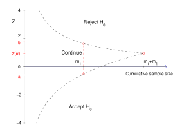

# A/B Testing

## What is it?
Comparison of two different versions of the same feature to judge which one is better. **Statistics** is used to differentiate between the result happening due to chance vs actual improvement.

## Different distributions
| Distribution | Data Type | Example Metric |
| --- | --- | --- |
Binomial | Binary (0 or 1) | Conversion Rate, Click-Through Rate |
Normal | Continuous (Averages) | Average Order Value, Time on Site |
Poisson | Counts (Rate) | Errors per session, Add-to-carts per user |
Exponential | Time Duration | Time until churn, Session duration |
Power | Continuous (with common outliers) | Revenue streams

## Hypotheses

$H_0$: Null hypothesis, which states there is no **significant** difference between the two distributions.

$H_1$: Alternate hypothesis, which states there is a **significant** difference between the two distributions.

## Error types

| | $H_0$ is true | $H_0$ is false
| --- | --- | --- |
| Reject $H_0$ | Type I Error | Correct |
| Accept $H_0$ | Correct | Type II Error

### $\alpha$ and $\beta$ values

$\alpha$ value:
- Level of significance
- Probability of commiting a Type I error
- Common value: 0.05 or 5%. This means that we accept a 5% chance of the alternate hypothesis being true due to chance.

Confidence (1 - $\alpha$):
- This represents the probability of us accepting the null hypothesis while it was true.

$\beta$ value:
- Probability of commiting a Type II error.
- Common value: 0.2 or 20%. This means we accept a 20% chance that we accept the null hypothesis even though we should not have.

Power (1 - $\beta$):
- This represents the probability of us accepting the alternate hypothesis while it was true.

**For the null hypothesis to be rejected, we want the curves to overlap on as minimum an area as possible.**

### Use of $\beta$
$\beta$ is used to find the required sample size for the test to be run.

$n \propto \frac{\sigma^2}{\delta^2}$

where $\delta$ represents the Minimum Detectable Effect. This signifies the minimum percentage of successes which will convince that the alternate hypothesis is true.

For formula usage, we use
$n = \frac{c.\sigma^2}{\delta^2}$

where c is a constant derived from the set $\alpha$ and $\beta$ values.

$c = (Z_{1-\alpha/2} + Z_{1-\beta})^2$

Since the MDE is squared and in the **denominator**, to detect smaller changes, the needed sample size increases even more.

## P-value
This represents the probability of observing data at least as extreme as your test results, assuming the null hypothesis is entirely true. $P(\text{Data} \mid H_0)$

## P-Hacking
This is when the results of a statistical test are manipulated to achieve a significant result, even though that might not be the case.

- Peeking: You look at the results way too early, and assume that result as the final result. You can use **sequential testing** [SPRT (Sequential Probability Ratio Test) or mSPRT] if you want to peek.

- Multiple comparisons: When testing a new feature, you deliberately try to find any metric for which the test gave significant results. If you are testing for N features, use **Bonferroni correction**; divide significance level by N or **Benjamini-Hochberg procedure**.

- Subgroup analysis: You slice the data to find any subset for which the test was significant.

## Sensitivity Analysis
Determine if a test is feasible within the given constraints. Usually means checking to see if the given MDE can be checked within the given time limit.

## Which test for which distribution
| Metric | Underlying Distribution | Example | Standard Test (Large N) | Specialized Test (Small N / High Variance)
| --- | --- | --- | --- | --- |
Yes / No | Binomial | Click vs. No Click | Z-Test / Chi-Squared | Fisher's Exact Test
Counts | Poisson | Pageviews, Errors | T-Test (Robust)| Poisson Regression / E-Test |
Time | Exponential | Time on Site | T-Test (Robust) | Survival Analysis (Log-Rank) |
Money | Log-Normal / Pareto | Revenue per User | T-Test (Risky!) | Mann-Whitney U or Bootstrapping

## Bootstrapping
Sampling with replacement run multiple times.

### Interpreting the results
- Check the simulated differences for all runs for the metric under consideration.
- Slice off the bottom and top 2.5%.
- The 95% central range left is the **confidence interval**.
- If the range has 0 in it, we fail to reject the null hyothesis, else the result is significant (both positive and negative).

## Two-tailed test vs one-tailed test
| Feature | Two-Tailed (Standard) | One-Tailed (Risky) |
| --- | --- | --- |
Hypothesis | "Is B different from A?" ($\neq$) | "Is B better than A?" (>)| 
Alpha Split | 2.5% Left / 2.5% Right | 5% Right (or Left) | 
Hurdle (Z) | 1.96 (Harder) | 1.645 (Easier) |
Blind Spot | None. Detects wins and losses. | Blind to the opposite direction. |
Use Case | 99% of A/B Tests. | Specific "Do No Harm" tests. |

## Sequential testing

- This is used when you still want to peek at the results.
- Early on in the test, a high Z-score is necesarry to either accept or reject the null hypothesis.
- As the sample size goes on increasing,, the test boundaries are relaxed.

## Bayesian testing
- Uptil now, all methods discussed were **frequentist**, meaning they dealth with hypotheses.
- Bayesian testing strategy deals in probabilities.
- Not only can they tell if a variant is a winner or not, they can also tell how much risk is there in case it turns out to be a loser.

Process:
- We initially assume nothing is known about either variant. We call this a **prior**. At the start, it is a simple flat line [$\beta(1,1)$].
- Once we start getting new data, we update our current distribution by adding it to the prior, and updating our belief.
- Then we plot both the curves, where the overlap will tell what are the chances of failure.
- Then we run a Monte Carlo simulation. Each round, a random value from both distributions is picked. Depending on the magnitude, the control or variant group wins.
- After all the rounds, we see how many times the variant beat the control group.
- We can also check the simulations where the variant lost to estimate the **expected loss**.

**Choosing the distribution remains the same as frequentist.**

### Prior distributions & Conjugate pairs
| If your Data is... | Use this Prior... | Because...
| --- | --- | --- |
Binomial (Conversions) | Beta Distribution | Adding data is just "Plus (+)" arithmetic. |
Poisson (Counts) | Gamma Distribution | It models the rate of events perfectly. | 
Normal (Averages) | Normal Distribution | It models the mean perfectly. |

### Chossing a prior
Do you have historical data?
- No: Use Weak Prior (1,1).
- Yes: Use Strong Prior (add historical success/failures to your starting count).

## Multi Armed Bandits
Instead of waiting for an A/B test to finish, a Multi-Armed Bandit dynamically shifts traffic to the winning variant in real-time. It is named after a gambler trying to find the highest-paying slot machine (a "one-armed bandit") in a casino.

### Thompson Sampling
It relies entirely on the Bayesian conjugate priors (Beta distributions) established in the previous section.

- Start with a weak prior for all variants, modeled as $\text{Beta}(1, 1)$.
- For every single new visitor, the algorithm runs a rapid Monte Carlo draw, pulling one random number from each variant's current Beta distribution.
- The visitor is immediately routed to the variant that produced the highest random number.The visitor either converts or bounces.
- The engine instantly updates the $\alpha$ (success) or $\beta$ (failure) count for that specific variant.
- The Result: As a variant proves it is a winner, its distribution shifts higher and becomes narrower. It naturally wins the random draw more often, effectively starving the losing variants of traffic.